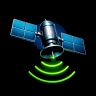
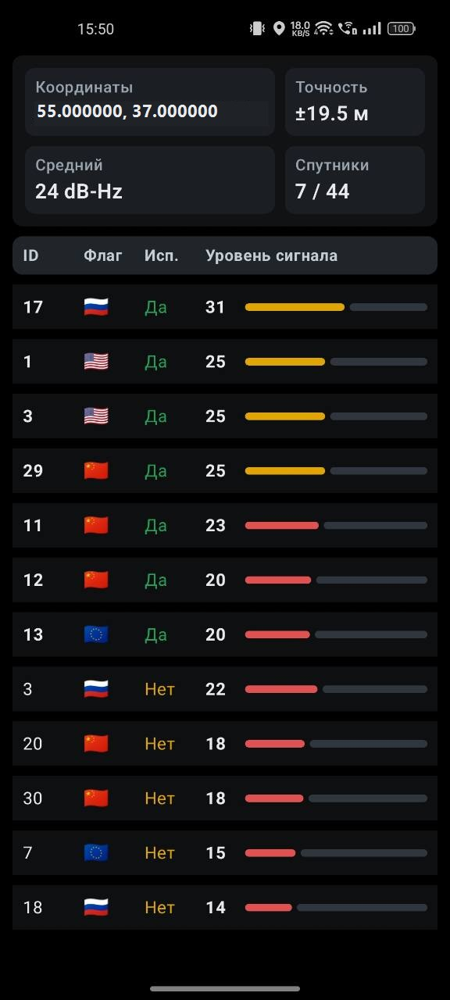

# Simple GNSS Status

Минималистичное Android-приложение для просмотра состояния спутниковой навигации.

Приложение показывает:

- координаты, если Android уже вычислил местоположение;
- точность координат;
- количество спутников `используется / видно`;
- средний уровень сигнала только по спутникам, которые используются в расчете координат;
- таблицу спутников с ID, флагом системы, признаком использования и уровнем сигнала.

Спутники с нулевым уровнем сигнала скрываются из таблицы.

## Демонстрация

## Разрешения

Приложению нужны:

- точная геолокация для чтения GNSS-статуса.

Во время просмотра приложение держит экран включенным, чтобы активный GNSS-сеанс не прерывался.

## Установка на телефон

1. Откройте страницу последнего релиза:
   [Latest release](https://github.com/strokinkv/Simple-GNSS-Status/releases/latest).
2. Скачайте APK-файл из раздела `Assets`.
3. Скопируйте APK на телефон или скачайте его сразу с телефона.
4. Откройте APK на телефоне и подтвердите установку.

Если Android попросит разрешить установку из неизвестного источника, разрешите ее для приложения, через которое открываете APK: браузера, файлового менеджера или мессенджера.
